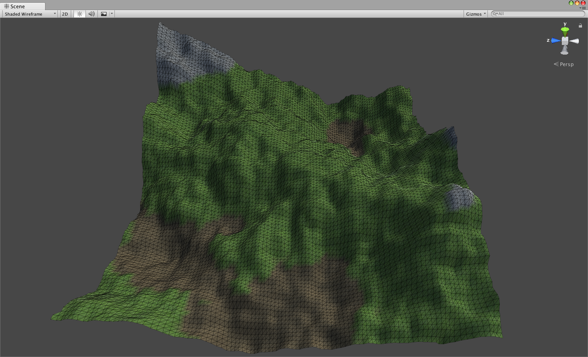

<h1 align="center">Procedural Terrain</h1>

 
  Creation of procedural terrain on Unity using computer graphics techniques.

<h1 align="center">Editor</h1>

  

<h1 align="center">Terrain with texture</h1>

  

<h1 align="center">License</h1>

  This project is available under the Apache license. See the LICENSE file for more info.

